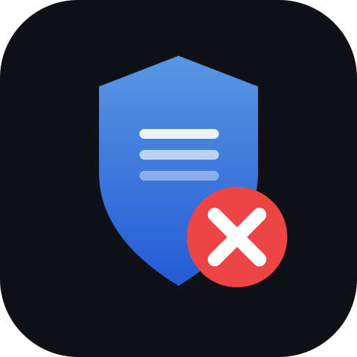

# blocklist-manager

I've been running pfSense + pfBlockerNG for a while, and one thing kept bothering me: even with ET, Spamhaus, and Hagezi active, there were still gaps compared to FireHOL. But just adding FireHOL on top creates a mess of duplicates.

So I built this to find only what's actually missing.

**Live demo:** https://ngfblog.github.io/blocklist-manager

---

## What it does

- Reads your active pfBlockerNG URLs directly from pfSense config
- Compares them against FireHOL level1/level2 and Hagezi Pro
- Finds only the IPs and domains you're not already covering
- Generates two clean output files you can point pfBlockerNG at
- Shows a breakdown in a simple web UI

The output files are optional. You can just use the analysis to decide what to add manually.

---

## Why GitHub?

Two reasons:

1. **Automation** — GitHub Actions runs the daily comparison. No server to maintain, no cron on your own machine.
2. **Hosting** — GitHub Pages serves the UI, and `raw.githubusercontent.com` gives pfBlockerNG a URL it can pull from directly.

Your config lives in your own forked repo. Nothing goes through any server of mine.

> The GitHub token only touches your own repo (read/write config file). If you'd rather not use the UI at all, just edit `my_lists.json` directly in GitHub — the automation works fine without it.

---

## Output files

| File | What's in it |
|------|-------------|
| `output/merged_ip.txt` | IPs from FireHOL not already in your lists |
| `output/merged_dnsbl.txt` | Domains from Hagezi Pro not already in your lists |

Both update automatically every day.

---

## Setup

### 1. Fork this repo

Fork to your own GitHub account, then enable Pages:  
Settings → Pages → Branch: `main` → Folder: `/ (root)` → Save

### 2. Install the sync script on pfSense

```bash
scp pfblockerng_sync.py root@YOUR_PFSENSE_IP:/root/Scripts/
```

Open the script and set your GitHub token:

```bash
nano /root/Scripts/pfblockerng_sync.py
```

Replace `YOUR_GITHUB_TOKEN_HERE` with a Personal Access Token (scope: `repo`).

**Creating a token:**
1. https://github.com/settings/tokens → Generate new token (classic)
2. Note: `blocklist-manager`, no expiration, scope: `repo`
3. Copy it — it won't show again

Test it:
```bash
python3.11 /root/Scripts/pfblockerng_sync.py
```

Add to cron (pfSense GUI → Services → Cron → Add):
- Minute: `30`, Hour: `2`, rest: `*`
- Command: `python3.11 /root/Scripts/pfblockerng_sync.py`

### 3. Add the output URLs to pfBlockerNG (optional)

**IP** — pfBlockerNG → IP → IPv4 → Add:
- Name: `BLM_IP_Gaps`
- Source: `https://raw.githubusercontent.com/YOUR_USERNAME/blocklist-manager/main/output/merged_ip.txt`
- Action: `Deny Both` / Update: `Every 6 hours`

**DNSBL** — pfBlockerNG → DNSBL → DNSBL Groups → Add:
- Name: `BLM_DNSBL_Gaps`
- Source: `https://raw.githubusercontent.com/YOUR_USERNAME/blocklist-manager/main/output/merged_dnsbl.txt`
- Action: `Unbound` / Update: `Every 6 hours`

### 4. Run GitHub Actions once

Actions → Update Blocklists → Run workflow

First run takes ~20 minutes. After that it runs at 03:00 UTC daily.

---

## How the sync works

```
02:30 local   pfSense cron → pfblockerng_sync.py → my_lists.json → GitHub
03:00 UTC     GitHub Actions → compare.py → recommendations.json → GitHub
              index.html reads both and shows live data
```

---

## File structure

```
blocklist-manager/
├── index.html                 # Web UI (GitHub Pages)
├── icon.svg
├── my_lists.json              # Your active pfBlockerNG lists (synced from pfSense)
├── pfblockerng_sync.py        # Runs on pfSense via cron
├── requirements.txt
├── .github/workflows/
│   └── update.yml
├── scripts/
│   ├── merge.py               # Builds gap output files
│   └── compare.py             # Builds recommendations
└── output/
    ├── merged_ip.txt
    ├── merged_dnsbl.txt
    ├── recommendations.json
    └── last_run.json
```

---

## Comparison sources

| Type | Source | Notes |
|------|--------|-------|
| IP | firehol_level1 | Aggregates 10+ trusted sources |
| IP | firehol_level2 | Broader, more aggressive |
| IP | blocklist.de | SSH/FTP/web attacks from the last 48h |
| DNSBL | Hagezi Pro | Large multi-source domain blocklist |

---

## Requirements

- pfSense 2.7+ with pfBlockerNG installed
- Python 3.11 on pfSense (included by default)
- GitHub account (free tier is fine)
- GitHub Personal Access Token (scope: `repo`)

---

## Support

Personal homelab project. If it was useful, a small donation is appreciated.  
👉 https://paypal.me/ShopNGF
