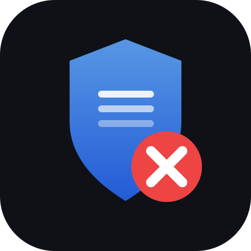

# blocklist-manager

pfSense + pfBlockerNG with a bunch of lists enabled, and there were still IPs slipping through that FireHOL would catch. Adding FireHOL directly just bloated everything with duplicates.

This finds the gaps — IPs and domains not covered by what you already have — and outputs clean files you can feed straight into pfBlockerNG.

**Live demo:** https://ngfblog.github.io/blocklist-manager

---

## How it works

Pulls your active pfBlockerNG URLs from pfSense config, compares them against FireHOL, blocklist.de, ipsum, and Hagezi, and writes only the missing entries to two output files. No duplicates, no overlap with what's already blocked.

The web UI shows coverage stats and flags what's worth adding. The output files themselves are optional — you can use the analysis without pointing pfBlockerNG at anything.

---

## Why GitHub Actions / Pages?

No server to maintain. Actions handles the daily comparison run, Pages hosts the UI, and `raw.githubusercontent.com` gives pfBlockerNG a direct URL to pull from.

Everything lives in your own fork. Nothing goes through any server of mine.

> The GitHub token only needs access to your own repo. If you prefer, skip the UI entirely and edit `my_lists.json` directly — the automation doesn't depend on it.

---

## Output files

| File | Contents |
|------|----------|
| `output/merged_ip.txt` | IPs missing from your current pfBlockerNG setup |
| `output/merged_dnsbl.txt` | Domains missing from your current DNSBL setup |

Updated automatically on every Actions run.

---

## Setup

### 1. Fork and enable Pages

Fork to your GitHub account, then:  
Settings → Pages → Branch: `main` → Folder: `/ (root)` → Save

### 2. Install the sync script on pfSense

```bash
scp pfblockerng_sync.py root@YOUR_PFSENSE_IP:/root/Scripts/
```

Edit the script and drop in your GitHub token:

```bash
nano /root/Scripts/pfblockerng_sync.py
```

Replace `YOUR_GITHUB_TOKEN_HERE` with a fine-grained Personal Access Token limited to this one repository (permission: Contents → Read and write).

**Creating a token:**
1. https://github.com/settings/personal-access-tokens/new → Generate new token (fine-grained)
2. Name it `blocklist-manager`, set an expiration, Repository access → *Only select repositories* → this repo
3. Permissions → Repository permissions → Contents: *Read and write*
4. Copy it immediately — it won't show again

Keep the script private: `chmod 600 /root/Scripts/pfblockerng_sync.py`. Put the token expiry date in your calendar — if the token expires, the sync stops and the workflow fails after 72 hours with a clear message.

Test it manually first:
```bash
python3.11 /root/Scripts/pfblockerng_sync.py
```

Then add to cron (pfSense GUI → Services → Cron → Add):
- Minute: `30`, Hour: `2`, rest: `*`
- Command: `python3.11 /root/Scripts/pfblockerng_sync.py`

### 3. Add output URLs to pfBlockerNG (optional)

**IP** — pfBlockerNG → IP → IPv4 → Add:
- Name: `BLM_IP_Gaps`
- Source: `https://raw.githubusercontent.com/YOUR_USERNAME/blocklist-manager/main/output/merged_ip.txt`
- Action: `Deny Both` / Update: `Every 6 hours`

**DNSBL** — pfBlockerNG → DNSBL → DNSBL Groups → Add:
- Name: `BLM_DNSBL_Gaps`
- Source: `https://raw.githubusercontent.com/YOUR_USERNAME/blocklist-manager/main/output/merged_dnsbl.txt`
- Action: `Unbound` / Update: `Every 6 hours`

### 4. Trigger the first run

Actions → Update Blocklists → Run workflow

First run takes around 20 minutes. After that it runs automatically every 6 hours (02:00, 08:00, 14:00, 20:00 UTC).

---

## Timing

```
02:30 local   pfSense cron runs pfblockerng_sync.py → pushes my_lists.json to GitHub
every 6 hours GitHub Actions runs → builds output files + recommendations.json
              index.html reads both and renders live data
```

---

## Repo layout

```
blocklist-manager/
├── index.html
├── icon.svg
├── my_lists.json              # synced from pfSense
├── pfblockerng_sync.py        # runs on pfSense
├── requirements.txt
├── .github/workflows/
│   └── update.yml
├── scripts/
│   ├── merge.py               # builds merged_ip.txt and merged_dnsbl.txt
│   ├── compare.py             # builds recommendations.json
│   └── netutil.py             # shared parsers, bogon list and fast overlap check
└── output/
    ├── merged_ip.txt
    ├── merged_dnsbl.txt
    ├── recommendations.json
    └── last_run.json
```

---

## Comparison sources

| Type | Source | Notes |
|------|--------|-------|
| IP | firehol_level1 | Consensus list aggregating 10+ trusted feeds |
| IP | firehol_level2 | Broader coverage, more aggressive |
| IP | blocklist.de | IPs that attacked SSH, FTP, and web servers in the last 48h |
| IP | ipsum level 3+ | IPs appearing on 3 or more independent blacklists, updated daily |
| DNSBL | Hagezi Pro | Large multi-source domain blocklist |

---

## Requirements

- pfSense 2.7+ with pfBlockerNG installed
- Python 3.11 on pfSense
- GitHub account (free tier works fine)
- GitHub Personal Access Token (scope: `repo`)

---

## ❤️ Support

Personal homelab project. If it saved you some time, a small donation is appreciated.  
👉 https://paypal.me/ShopNGF

---

## Safety checks

The workflow refuses to publish when something looks wrong, so a broken download can never reach your firewall:

- a source returns fewer entries than expected (empty or truncated file), or most of its lines can't be parsed
- `my_lists.json` is older than 72 hours (pfSense sync stopped)
- every `git push` attempt is rejected

On any of these the run fails, the previous `output/` files stay untouched, and GitHub emails you about the failed run. Entries shorter than `/8` are dropped automatically.
